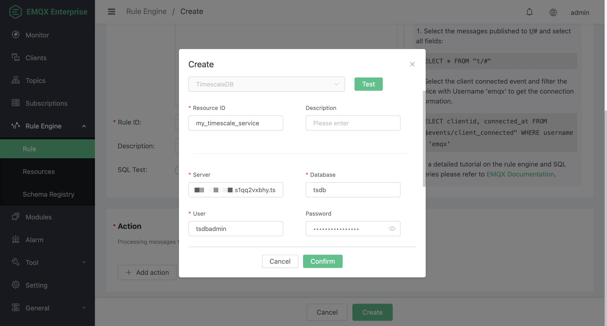
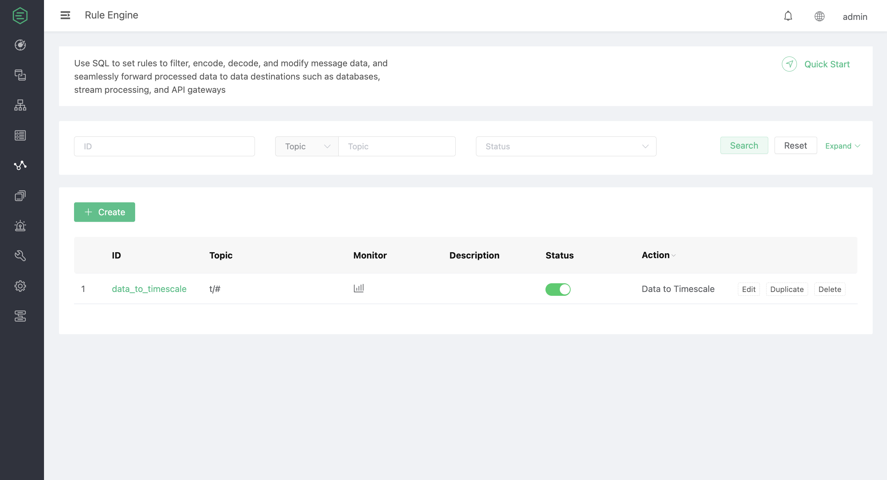

# Ingest Data into TimescaleDB

EMQX supports integration with TimescaleDB so you can save mqtt messages and client events to TimescaleDB or Timescale Service.

## Set up TimescaleDB and Create Tables

Using Timescale Service to set up a TimescaleDB instance, or use TimescaleDB Docker image.

:::: tabs type:card
::: tab Timescale Service

1. [Create a Timescale account](https://docs.timescale.com/getting-started/latest/services/#create-your-timescale-account), if you don't have one.
  
2. Sign in to the Timescale portal and [create a Timescale service](https://docs.timescale.com/getting-started/latest/services/#create-your-first-service), save the **password** of the service.

3. Get the connection info from service overview page, The fields required by EMQX including **Database name**, **Host**, **Port** and **Username**.

4. [Connect to service](https://docs.timescale.com/getting-started/latest/services/#connect-to-your-service) with psql client.

```bash
# connect to service by service URL
psql "postgres://tsdbadmin@xxxxx.xxxxx.tsdb.cloud.timescale.com:32541/tsdb?sslmode=require"
# use password in step 2
Password for user tsdbadmin:
```

5. Create a table to save the client sensor data.

```sql
CREATE TABLE sensor_data (
    time        TIMESTAMPTZ       NOT NULL,
    location    TEXT              NOT NULL,
    temperature DOUBLE PRECISION  NULL,
    humidity    DOUBLE PRECISION  NULL
);

SELECT create_hypertable('sensor_data', 'time');
```

After successful creation, you can view the `sensor_data` table info in the **Explorer** Tab of the service.


:::

::: tab TimescaleDB Docker
:::
::::

1. [Install Docker](https://docs.docker.com/install/), if you don't have one.

2. Create a TimescaleDB container with Docker, set the password of the database by `POSTGRES_PASSWORD` environment variable.

```bash
docker run -d --name timescaledb \
    -p 5432:5432 \
    -e POSTGRES_PASSWORD=<your-password> \
    timescale/timescaledb:latest-pg13
```

1. Create a database to save the client sensor data.

```bash
docker exec -it timescaledb psql -U postgres

## create tsdb database
> CREATE database tsdb;

> \c tsdb;
```

4. Initiate the table.

```sql
CREATE TABLE sensor_data (
    time        TIMESTAMPTZ       NOT NULL,
    location    TEXT              NOT NULL,
    temperature DOUBLE PRECISION  NULL,
    humidity    DOUBLE PRECISION  NULL
);

SELECT create_hypertable('sensor_data', 'time');
```

## Create a Rule

Go to [EMQX Dashboard](http://127.0.0.1:18083/#/rules), select the
"rule" tab on the menu to the left.

Select "message.publish", then type in the following SQL:

```sql
SELECT
    payload.temp as temp,
    payload.humidity as humidity,
    payload.location as location
FROM
    "t/#"
```


### Add an Action

1. Click on the **+ Add** button under **Action Handler**, and then select **Data persist** -> **Data to TimescaleDB** in the dialog window. And click **Create** button to create a Timescale resource.


2. Fill in the connection info in new dialog, use `<host>:<port>` as **Server**, and click **Confirm** button to create a Timescale resource.



3. Input SQL template. SQL template is the sql command you'd like to run
when the action is triggered. In this example, we'll insert a message
into TimescaleDB, so type in the following SQL
template:

```sql
INSERT INTO 
    sensor_data (time, location, temperature, humidity)
VALUES 
    (NOW(), ${location}, ${temp}, ${humidity})
```

Before data is inserted into the table, placeholders like `${key}` will be replaced by the corresponding values.

Back to the creating rule page, then click on the "Create" button. The rule we created will be shown in the rule list.




## Test the Rule

We have finished creating the rule, test the rule by sending an MQTT message to EMQX:

```bash
mqttx pub -t t/1 -m '{"temp":24,"humidity":30,"location":"hangzhou"}'
```

Then inspect the TimescaleDB table, verify a new record has been
inserted:

```bash
tsdb=> select * from sensor_data;
             time              | location | temperature | humidity
-------------------------------+----------+-------------+----------
 2023-06-25 10:14:05.456206+00 | hangzhou |          24 |       30
(1 row)
```

And from the rule list, verify that the "Matched" column has increased
to 1:


