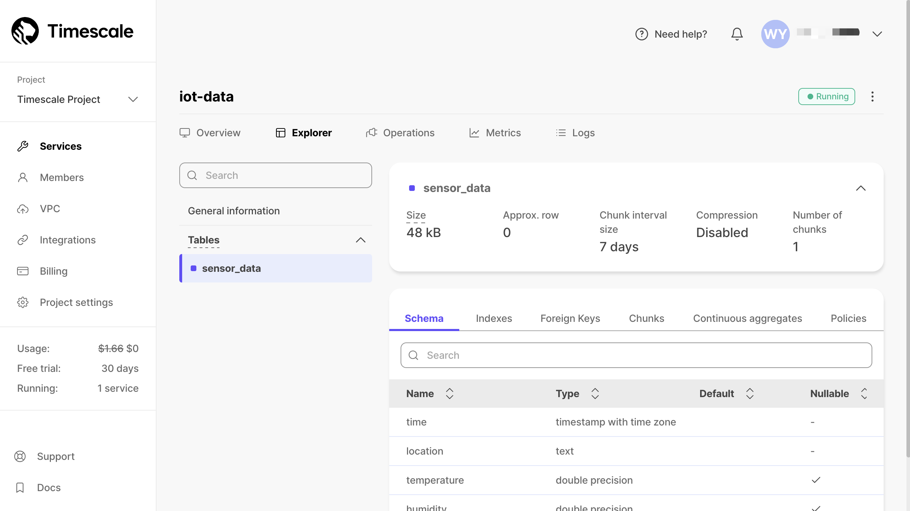

# TimescaleDB

[TimescaleDB](https://www.timescale.com/) (Timescale) 是一个专门用于存储和分析时间序列数据的数据库，它的出色数据吞吐能力和可靠的性能表现使其成为物联网领域的理想选择，能够为物联网应用提供了高效、可扩展的数据存储和分析解决方案。


:::tip
EMQX 企业版功能。EMQX 企业版可以为您带来更全面的关键业务场景覆盖、更丰富的数据集成支持，更高的生产级可靠性保证以及 24/7 的全球技术支持，欢迎[免费试用](https://www.emqx.com/zh/try?product=enterprise)。
:::


::: tip 前置准备

- 了解[规则](./rules.md)。
- 了解[数据桥接](./data-bridges.md)。

:::

## 特性

- [连接池](./data-bridges.md#连接池)
- [异步请求模式](./data-bridges.md#异步请求模式)
- [批量模式](./data-bridges.md#批量模式)
- [缓存队列](./data-bridges.md#缓存队列)
- [SQL 预处理](./data-bridges.md#SQL-预处理)

## 快速开始教程

本节介绍了如何安装 Timescale 并创建数据表、创建规则和数据桥接以将数据转发至 Timescale以及测试规则和桥接。

以下步骤假设您在本地机器上同时运行 EMQX 和 Timescale（若私有部署）。 如果您有远程运行的 EMQX 和 Timescale，请相应地调整设置。

### 安装 Timescale 并创建数据表

EMQX 支持与私有部署的 TimescaleDB 或与云上的 Timescale Service 集成。您可以使用 Timescale Service 云服务或者 Docker 部署一个 TimescaleDB 实例。

:::: tabs 
::: tab Timescale Service

1. 如果您没有 Timescale 账户，参考[创建一个 Timescale 账户](https://docs.timescale.com/getting-started/latest/services/#create-your-timescale-account)。
  
2. 登录到 Timescale portal 并[创建 Timescale service](https://docs.timescale.com/getting-started/latest/services/#create-your-first-service), 注意保存服务的密码。

3. 在 Overview 页面获取连接信息, EMQX 所需的字段包括 **Database name**, **Host**, **Port** and **Username**。

4. 使用 `psql client` [连接到 service](https://docs.timescale.com/getting-started/latest/services/#connect-to-your-service)。

   ```bash
   # 使用 servie URL 连接
   psql "postgres://tsdbadmin@xxxxx.xxxxx.tsdb.cloud.timescale.com:32541/tsdb?sslmode=require"
   # 输入使用步骤 2 中的密码
   Password for user tsdbadmin:
   ```

5. 创建 `sensor_data` 表用于存储客户端发布的消息：

   ```sql
   CREATE TABLE sensor_data (
       time        TIMESTAMPTZ       NOT NULL,
       location    TEXT              NOT NULL,
       temperature DOUBLE PRECISION  NULL,
       humidity    DOUBLE PRECISION  NULL
   );
   
   SELECT create_hypertable('sensor_data', 'time');
   ```

完成后, 您可以在 service 详情中的 **Explorer** 页签中查看  `sensor_data` 表的信息：



:::

::: tab TimescaleDB Docker

1. 如果没有 Docker 环境请[安装 Docker](https://docs.docker.com/install/)。

2. 启动 TimescaleDB 容器，并通过环境变量设置数据库密码。

   ```bash
   docker run -d --name timescaledb \
       -p 5432:5432 \
       -e POSTGRES_PASSWORD=public \
       timescale/timescaledb:latest-pg13
   ```

3. 创建数据库。

   ```bash
   docker exec -it timescaledb psql -U postgres
   
   ## create tsdb database
   > CREATE database tsdb;
   
   > \c tsdb;
   ```

4. 创建 `sensor_data` 表用于存储客户端发布的消息。

   ```sql
   CREATE TABLE sensor_data (
       time        TIMESTAMPTZ       NOT NULL,
       location    TEXT              NOT NULL,
       temperature DOUBLE PRECISION  NULL,
       humidity    DOUBLE PRECISION  NULL
   );
   
   SELECT create_hypertable('sensor_data', 'time');
   ```

:::
::::

### 创建规则与数据桥接

1. 转到 Dashboard **数据集成** -> **规则**页面。

2. 点击页面右上角的**创建**。

3. 输入规则 ID `my_rule`，在 SQL 编辑器中输入规则，此处选择将 `t/#` 主题的 MQTT 消息存储至 TimescaleDB，规则 SQL 如下：

   ```sql
   SELECT
     payload.temp as temp,
     payload.humidity as humidity,
     payload.location as location
   FROM
       "t/#"
   ```

4. 添加动作，在动作下拉框中选择**使用数据桥接转发**选项，点击在数据桥接下拉框旁边的 **+** 按钮创建数据桥接，进入**创建数据桥接**弹出页面。

5. 在数据桥接类型中选择 TimescaleDB，输入数据桥接名称，要求是大小写英文字母和数字的组合。

6. 根据你的部署方式输入对应的 TimescaleDB 连接信息，如果使用的是 Docker，**服务器地址**填写 `127.0.0.1:5432`，**数据库**填写 `tsdb`，**用户名**为 `postgres`，**密码**为 `public`。

7. 配置 SQL 模板，使用如下 SQL 完成数据插入。

   ::: tip

   此处为[预处理 SQL](./data-bridges.md#sql-预处理)，字段不应当包含引号，SQL 末尾不要带分号 `;`。

   :::

   ```sql
    INSERT INTO
    sensor_data (time, location, temperature, humidity)
    VALUES
      (NOW(), ${location}, ${temp}, ${humidity})
   ```

8. 高级配置（可选），根据情况配置同步/异步模式，队列与批量等参数。

9. 点击**添加**按钮完成数据桥接创建，此时会自动返回到**添加动作**页面，点击**添加**按钮将数据桥接添加到规则动作中。

10. 点击**创建**按钮完成规则创建。

至此您已经完成整个创建过程，可以前往 **数据集成** -> **Flows** 页面查看拓扑图，此时应当看到 `t/#` 主题的消息经过名为 `my_rule` 的规则处理，处理结果交由 TimescaleDB 进行存储。


### 测试数据桥接与规则

使用 MQTTX 向 `t/1` 主题发布消息，此操作同时会触发上下线事件：

```bash
mqttx pub -i emqx_c -t t/1 -m '{"temp":24,"humidity":30,"location":"hangzhou"}'
```

分别查看数据桥接运行统计，命中、发送成功次数均 +1。

查看数据是否已经写入`sensor_data` 表中：

```bash
tsdb=# select * from sensor_data;
             time              | location | temperature | humidity 
-------------------------------+----------+-------------+----------
 2023-07-10 08:28:48.813988+00 | hangzhou |          24 |       30
 2023-07-10 08:28:57.737768+00 | hangzhou |          24 |       30
 2023-07-10 08:28:58.599537+00 | hangzhou |          24 |       30
(3 rows)
```
